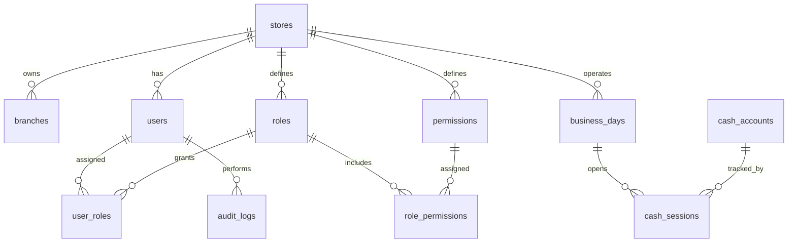
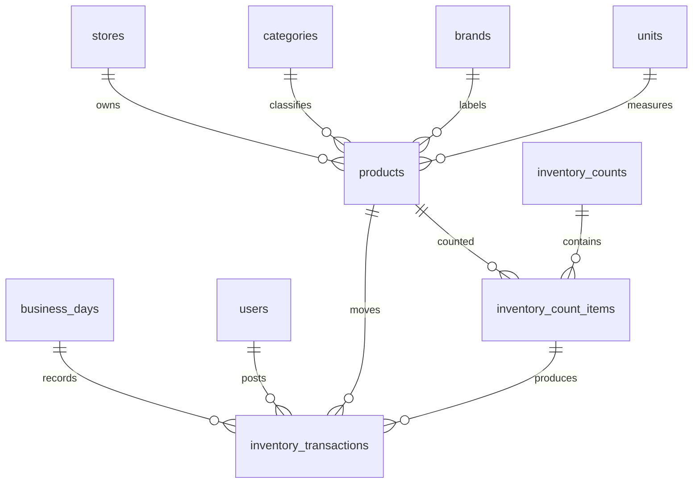
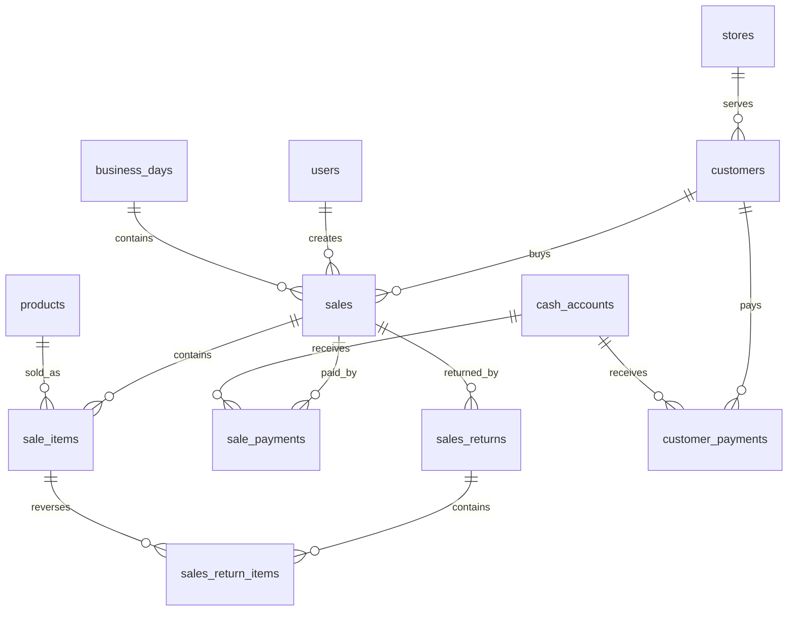
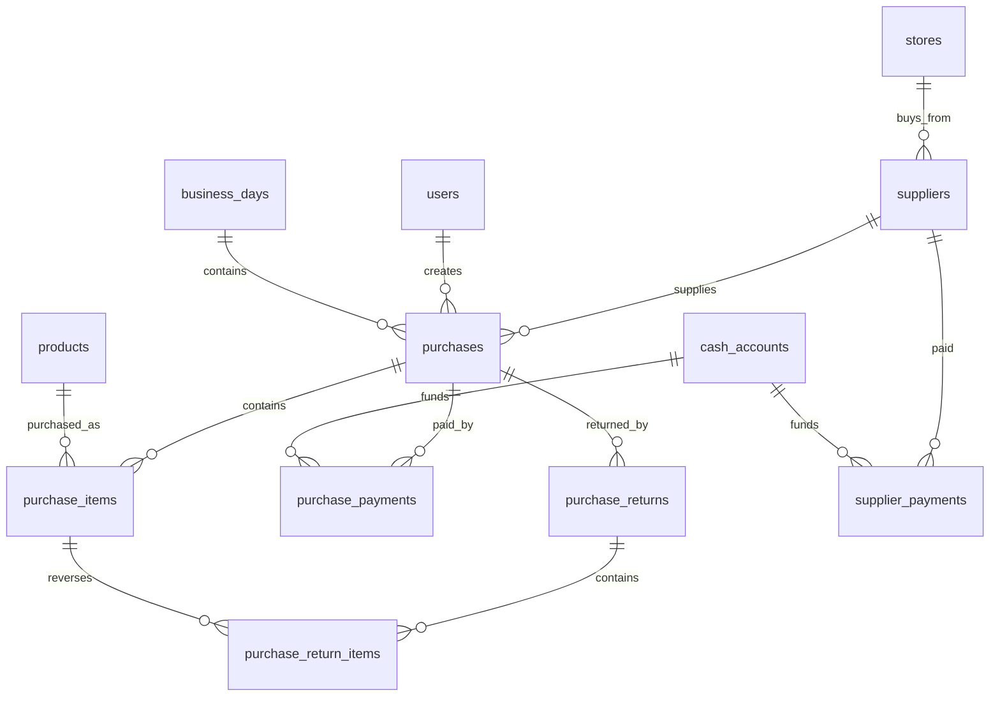
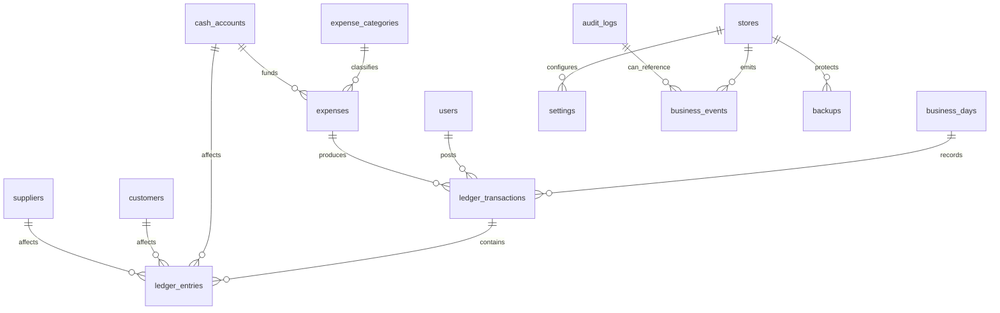

# Entity Relationship Diagrams

These diagrams describe business relationships. They are not SQL definitions.

## Core Store, Security, and Operations

Relationship count: 12.

## Product and Inventory

Relationship count: 10.

## Sales and Customer Payments

Relationship count: 13.

## Purchases and Supplier Payments

Relationship count: 13.

## Financial Ledger, Expenses, Events, and Backup

Relationship count: 13.

## Future Compatibility Notes

`branches` is included even though Version 1.0 operates as a single branch. Version 1.0 should create
one default branch per store and attach operational records to that branch where appropriate.

Cloud synchronization should sync immutable business facts first: sales, purchases, payments,
inventory transactions, ledger transactions, audit logs, and business events.
