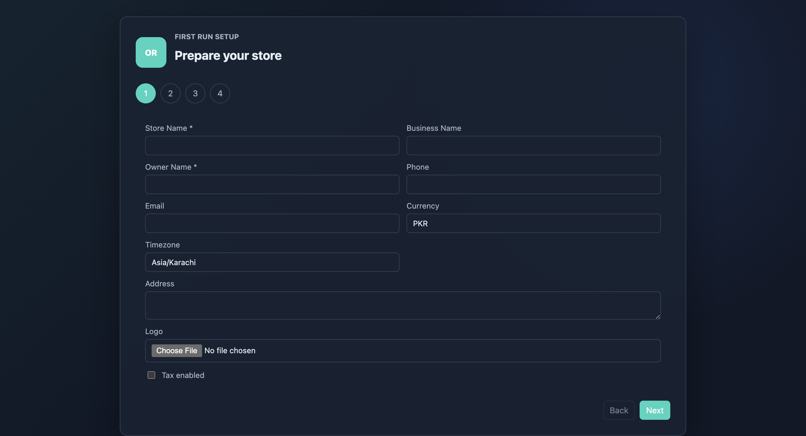
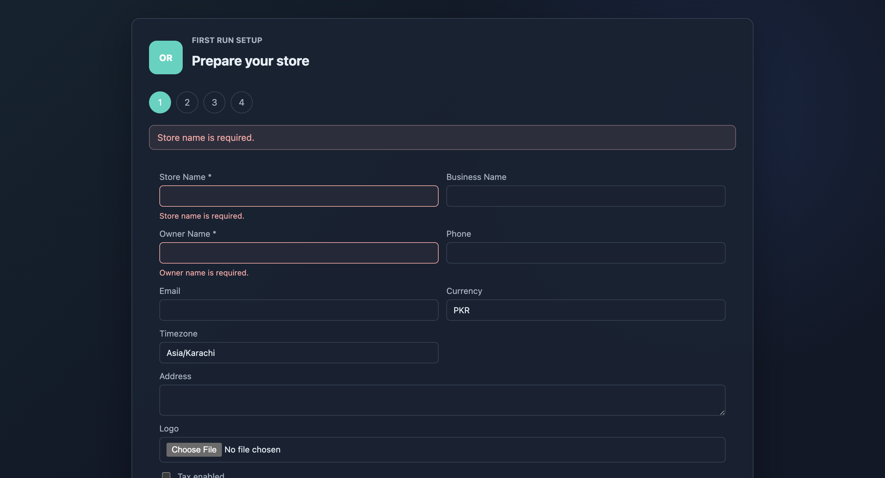
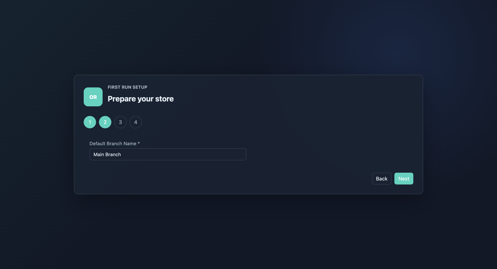
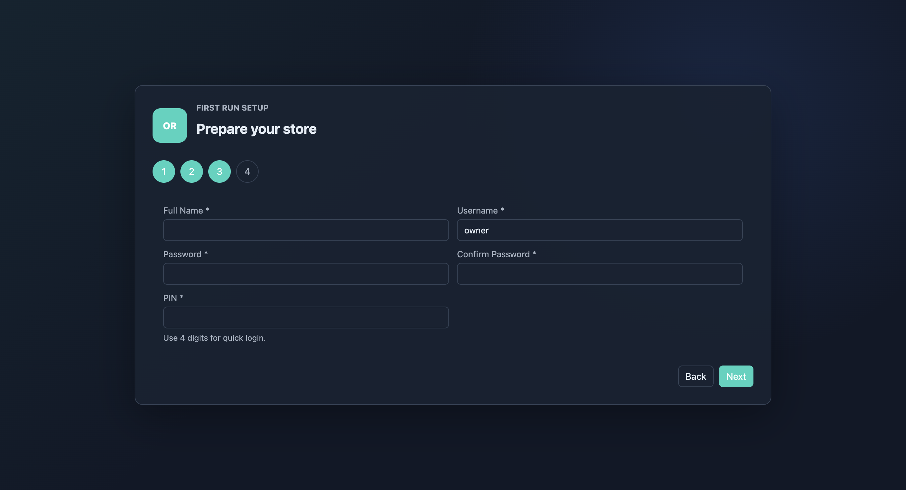
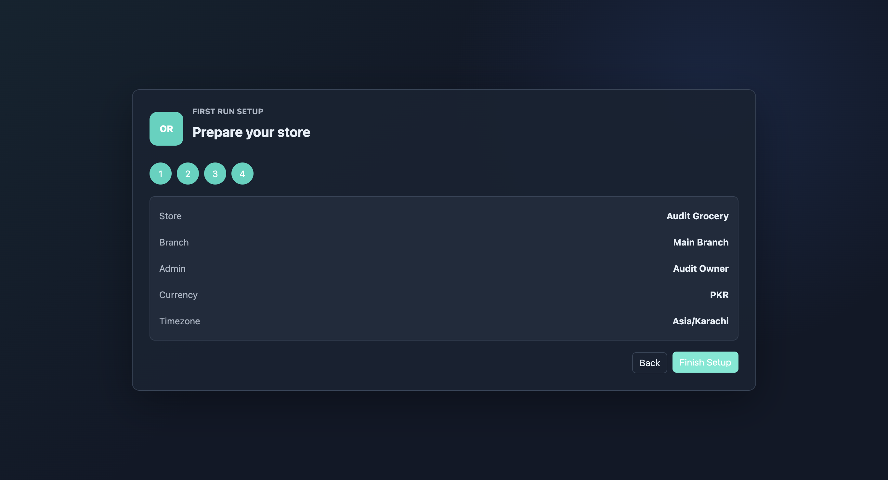
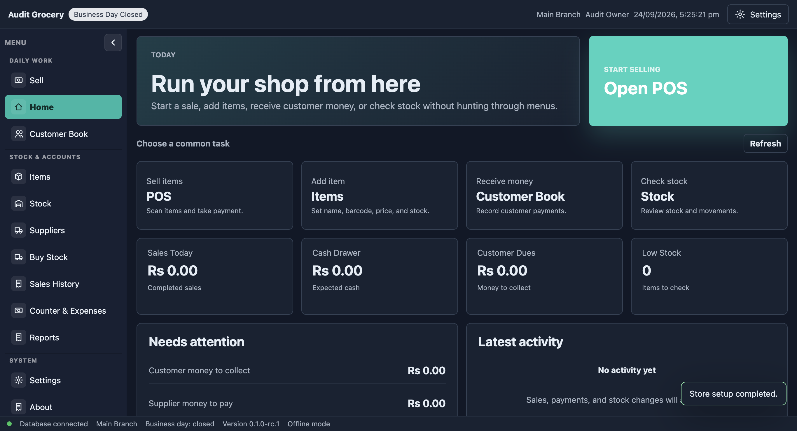
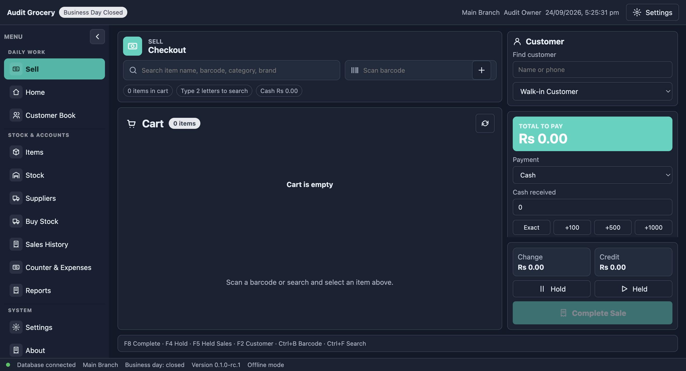

# Onboarding UI and UX audit — 2026-09-24

Verdict: the happy path works, and the visual identity is coherent, but onboarding needs another pass before an unassisted single-counter store handoff. The largest gap is helping an owner reach trading readiness after creating the store.

Scope: actual Electron app, version 0.1.0-rc.1, fresh isolated temporary profile, macOS, dark theme, 1366 × 740 CSS-pixel viewport. Captured using agent-browser over local CDP. All seven screenshots below were captured and inspected in this audit. No application code or existing store data was changed. Setup completed successfully and signed the owner in automatically. Source review supplements live observations.

## Flow and evidence

### 1. Store details — needs simplification

Consistent branding, persistent labels, useful PKR/Karachi defaults, and clear primary action. However, ten controls mix essential identity with optional receipt branding and configuration. Store Name versus Business Name is unexplained. Currency and timezone require technical free text. Logo has no visible preview, file-size guidance, or remove action. Tax enabled has no explanation of what the switch changes. Optional fields are not explicitly marked optional.

Recommendation: ask for store name and owner identity first. Keep currency/timezone defaults with a clear change control; move receipt details and branding to an optional section. Explain tax behavior rather than implying that one checkbox completes tax setup.

### 2. Validation — partially good

Submitting blank fields produced visible inline errors and red outlines. Shared Field source includes required, aria-invalid and aria-describedby, which is a good foundation. But the same first error appears in a summary and inline, with an additional toast on submission. Focus remained on Next (confirmed through document.activeElement). At this viewport, the error state increased document height to 868px and pushed the bottom actions below the captured viewport; this is scrolling, not proof that controls are inaccessible.

Recommendation: focus the first invalid field, retain inline messages, use an accessible summary for multiple errors, and keep navigation predictably placed. Review Enter-key form submission: the wizard is built from divs and click handlers rather than a form. Keyboard-only traversal and screen-reader announcements need a dedicated check.

### 3. Branch — unnecessary separate step

An entire screen contains only Default Branch Name, prefilled Main Branch. This is disproportionate after the dense first screen and exposes terminology the specified one-computer, one-counter store does not need to decide.

Recommendation: automatically create the default location/counter. Keep renaming in Settings if necessary. Remove this separate step from the single-counter onboarding journey.

### 4. Owner account — usable, missing guidance

Username defaults to owner; the PIN has a clear four-digit instruction. Full Name starts empty even though Owner Name was already entered. Password requirements appear only after validation (source requires eight characters). Setup lacks the password visibility control available in the login screen. PIN is an unmasked text input. The page does not clearly explain the owner account's authority or distinguish password use from quick PIN access beyond a short hint.

Recommendation: prefill the owner name with an edit option, show password requirements before entry, add show/hide for credentials, mask PIN by default, and explain when each credential is used. Avoid storing passwords/PINs in a resumable setup draft.

### 5. Review — incomplete confidence check

A concise summary is helpful, but it excludes username and tax status, and there are no direct Edit actions. To correct store details, the owner must go Back repeatedly. Progress circles show only numbers; previous and current steps share the same fill, and source has no aria-current. The panel changes height and vertical position substantially between steps.

Recommendation: named steps (Store, Owner access, Review), a distinct current step, direct section editing, and a summary of consequential settings. Explain that creating the store is followed by preparing the counter.

### 6. First launch — highest-priority UX gap

Setup completed and automatically signed in the owner, avoiding redundant login. A success toast confirms completion. The ordinary dashboard then promotes Open POS while the header states Business Day Closed. Metrics are all zero and there is no onboarding checklist for products, opening stock, opening float, receipt/peripheral checks, backup, or cashier creation.

Recommendation: show a persistent first-run readiness panel with relevant actions and completion states. Prioritize adding/importing items and opening stock, opening the counter with a counted float, receipt/printer/scanner checks, and a backup. Cashier creation can be optional if the owner runs the counter. Separate required operational prerequisites from optional tasks; do not introduce a mandatory tour or a sample transaction that contaminates live records.

### 7. First sale entry — generic empty state

Open POS leads to a checkout screen telling the owner to scan or search for an item despite the empty catalog. The cart is empty and Complete Sale is disabled. There is no contextual Add your first item action or prominent Open counter next step here. This is a guidance gap; this audit did not attempt a transaction or demonstrate a bypass of backend counter guards.

Recommendation: distinguish an empty store from an empty basket. Link directly to adding/importing inventory and opening the counter, then return to checkout.

## Accessibility and visual findings

- High priority: computed white text on dark-theme teal #2dd4bf is approximately 1.86:1. The observed Finish Setup hover background #5eead4 gives approximately 1.48:1. These fall below the 4.5:1 requirement for ordinary text described by [W3C Contrast Minimum](https://www.w3.org/WAI/WCAG22/Understanding/contrast-minimum.html). Measured labels were 14px. Use dark text on bright teal or darker button backgrounds; check default, hover, focus and disabled states separately.
- Positive: consistent typography and spacing, real labels, native inputs/buttons, visible text errors, and distinct primary/secondary action styling.
- Medium priority: current-step semantics and focus handling are missing from the wizard. The source uses unnamed numeric spans for progress and does not move focus on step transitions/errors.
- Medium priority: improve stable positioning and density. The first screen is tall, the branch screen sparse, and the centered card moves between steps. Use a consistent-width, top-aligned form with predictable footer placement.
- Source-only resilience finding: setup state exists only in component state. There is no draft persistence in SetupWizard, so restarting before completion cannot resume that draft. Runtime interruption was not tested here. Consider retaining non-secret fields only, or explicitly explaining that setup is unsaved.

## Proposed change order

1. Correct primary-button contrast and validation focus.
2. Replace the branch-only screen with an automatic single-counter default; name the remaining steps and reuse owner identity.
3. Improve account hints and review editing.
4. Add a persistent post-setup readiness checklist and contextual empty-store actions.
5. Improve optional branding controls and non-secret draft recovery.

Suggested journey: Store essentials → Owner access → Review and create → Prepare the counter → Sell. Preserve the current design language while correcting hierarchy and guidance.

## Limits

This is an expert review of the captured path, not a usability study with store staff or a complete accessibility certification. Windows scaling, 1024px displays, light theme, 200–400% zoom, full keyboard traversal, screen readers, credential recovery, hardware, logo upload failures, interrupted setup and real sales were not tested in this audit. The initial audit flow auto-authenticated the owner, so the returning-user login screen was source-reviewed only, not included as a captured step. No implementation fixes were made.

## Implementation follow-up — 2026-09-25

Implemented a three-step single-counter setup (Store essentials, Owner access, Review). Optional receipt/region fields are collapsed, owner identity carries forward, credentials are masked with an explicit reveal control, password guidance is visible, review includes username/tax and direct edit actions, and validation focuses the first invalid field. Navigation uses form submission and a sticky footer. Logo upload now has size/type checks, a preview, removal, and read-error feedback. The wizard states that entries are saved on creation; interrupted setup drafts are not persisted.

New stores get an owner-only readiness checklist on Home and a compact contextual reminder on Sell. Item availability, open counter and a recorded verified backup are read from the application. Stock and hardware readiness are explicitly owner confirmations saved in local browser storage, not a hardware certification. The checklist can be completed and later reopened from Home. Existing stores are not automatically enrolled. Core checkout authorization remains enforced by the backend.

Primary actions now use a theme-aware foreground color. The new readiness component is separate from the main renderer module. Windows hardware and assistive-technology acceptance checks remain outstanding.

Validation: `pnpm check` passed lint, type checking, build and 69 tests across 26 files. Electron coverage now includes the new-store setup journey, first-error focus, credential masking, editable review, persistence after reload, contextual empty-store actions, and checkout-action visibility at 1024×768. The existing checkout and two crash-recovery journeys also passed. Screenshots are generated under `test-results/onboarding-*.png`.
