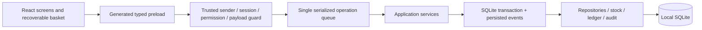

# Single-counter hardening handoff — 23 September 2026

> Update: [Windows diagnostics and update workflow](windows-support-and-updates.md) documents the subsequent crash logging, support export, and pre-migration backups.

## Release decision

This working tree is ready for **isolated store acceptance testing**, not an unconditional production release. Substantial security, cash, transaction, recovery, and checkout defects from the baseline audit have been fixed. Windows installation, actual peripherals, abrupt power loss, and the dependency/security issues below still need clearance before real trading.

The baseline audit describes the original checkout at `1e3e973`. This document describes subsequent changes; do not read the original findings as a list of unchanged defects.

## Try the isolated training store

From the repository root:

```sh
pnpm seed:demo
pnpm desktop:demo
```

The seed uses `.orix-demo/`, separate from the normal Electron profile. It refuses to seed an existing unmarked database. Rerunning it preserves existing demo records instead of duplicating products, stock, or sales. Do not use these credentials or copy this database into production.

| Role    | Username | Password         | PIN  |
| ------- | -------- | ---------------- | ---- |
| Owner   | owner    | DemoOwner!2026   | 2468 |
| Cashier | cashier  | DemoCashier!2026 | 1357 |
| Viewer  | viewer   | DemoViewer!2026  | 9876 |

Includes 600 products, 12 customers, 4 suppliers, cash/credit sales, a held basket, customer/supplier opening balances, zero/low stock examples, and a counter opened with Rs 500 training float. Barcode `9900000000600` exercises a product beyond the former first-page limit. Demo sales change the drawer balance, so it will exceed the opening float.

`desktop:demo` prepares SQLite for Electron. `pnpm test` prepares it for host Node. Do not run native preparation, desktop launch, and tests simultaneously in this checkout.

## Architecture implemented



This remains an offline modular desktop application: one process, one counter, one database. No server, cloud synchronization, or microservices were introduced. Separate modules now own IPC policy, SQLite transactions/events, backup validation/replacement, store-local date calculation, login attempt limits, counter operations, dialogs, and basket recovery. The preload JavaScript is generated from TypeScript during build rather than maintained separately.

The main process and renderer entry point still contain substantial legacy code. This is an incremental hardening pass, not a completed architectural rewrite.

## What changed

- Setup cannot be replayed. IPC checks session lock, active user, trusted renderer URL and action permissions. Unlisted channels fail closed. Manager access cannot create/reset Owner accounts, and the last active Owner is protected. User/credential/role saves are atomic. Failed login/PIN attempts have a process-local cooldown. Navigation/new windows are blocked and a renderer content policy is installed.
- Mutations execute serially. Required domain events persist in the same transaction as stock, documents, and ledger changes. Checkout operation IDs make an identical completion retry return the original sale; changed payloads using the same ID are rejected.
- Drawer cash comes from posted cash ledger entries plus opening float. Home, counter, and report drawer totals share this calculation. Change is not subtracted twice. New bank/card/mobile-wallet customer and supplier payments use noncash settlement accounts.
- Sale and purchase return values allocate original net document totals with cumulative cent rounding. Duplicate return lines are rejected. Sale cash refunds cannot exceed cash originally collected less prior cash refunds; unpaid credit returns use customer credit. Purchase freight/other charges are excluded from merchandise refunds.
- Counter opening, expenses, counted cash, explained variance, closing, and closing backup are implemented. Financial postings require an open counter. Expenses have retry IDs. Closing backup failure is reported separately from a successful close.
- Store timezone determines business days and report boundaries. Overnight open sessions remain attached to their original trading day until closed. No new sale posts into a closed session.
- Catalog search and exact barcode lookup query the database, including products beyond the former 500-item cache. Customer lookup is searchable. Report totals no longer stop after fixed row limits.
- Basket state and its checkout retry ID survive navigation/reload per user. Empty/completed baskets clear local recovery. A recovery-write failure is visible. Keyboard search, modal focus trapping/restoration, screen-reader messages, pinned checkout actions, and expandable adjustments improve the counter workflow.
- Backups are checked for SQLite integrity, foreign keys, current migration history, complete schema, indexes and constraints. Restore stages and verifies a SQLite snapshot including WAL data, preserves a safety backup, closes the connection, atomically replaces the file, blocks subsequent IPC, and schedules restart. No partial file copy overwrites the live database.

## Verification

Run `pnpm check` and `pnpm test:e2e`. The suite includes 61 Vitest tests across 23 files; one integration wrapper additionally executes 21 real-database desktop scenarios. These cover authorization, cash/change/refunds, noncash payments, duplicate checkout, event rollback, concurrent requests, report completeness, barcode lookup, owner protection, closed-counter enforcement, backup validation, WAL synchronization settings, and a successful restore with a readable safety backup.

The Electron journey uses a disposable seeded profile and exercises login, expense entry, the item modal, barcode checkout, navigation/reload recovery, and the next-customer flow. Screenshots are written under ignored `test-results/`. The headless IPC adapter uses real services, repositories, migrations and SQLite, but fakes the Electron shell; the separate Electron test uses the real app.

The new GitHub workflow runs Windows checks, Electron E2E and unpacked packaging. It has not yet executed on GitHub; local macOS results do not establish Windows readiness.

## Daily workflow

1. Sign in and open **Counter & Expenses**. Enter the actual opening float. A closed day cannot be reopened through this screen; start the next local business day with a fresh count.
2. Use **Sell**. Scan a barcode followed by Enter, or type two letters and choose a search result with arrows/Enter. Cash is the default. Credit requires a customer; use Cash + Credit for split settlement.
3. F8 opens completion confirmation. F4 holds a basket; F5 lists held baskets. Ctrl+B focuses barcode, Ctrl+F item search, and F2 customer selection. New Sale/Escape exits the receipt and returns to scanning.
4. Record cash expenses when they occur. Reconcile the actual drawer count at closing and explain any difference. Check that the closing backup succeeded.
5. Configure an off-device backup folder in Settings and test restore on an isolated installation. A backup on the same disk does not protect against disk loss. Restore replaces store records and requires the literal `RESTORE` confirmation.

## Remaining release gates and functionality

Before real trading:

- Validate a clean Windows x64 installation and upgrade, supported Electron/dependency versions, native SQLite packaging, and distribution/version/signing policy. Electron is still 33.4.11 and the earlier production audit reported a high Drizzle advisory; these were not cleared in this pass.
- Test the actual receipt printer (including cancellation, paper-out, correct width, and reprints), scanner, Windows scaling, offline launch, long shift, and abrupt termination/restart. Browser print-dialog success is not proof that paper printed.
- Independently reconcile discounted/taxed partial returns, mixed-payment returns, supplier returns, customer/supplier balances and credit limits using the store's real policies. Current tests do not exhaust those combinations. Historical noncash ledger entries created by older versions are not automatically rewritten.
- Perform restore from the off-device backup on a fresh machine and failure tests for disk-full, permission loss and interrupted replacement. Restore currently accepts this application's exact schema version; older/newer backup migration is not implemented.
- Expand role/action coverage, inactivity locking, authenticated owner recovery, audit browsing/export, support diagnostics, and correction/reversal flows for expenses and payments. Do not correct posted transactions by editing SQLite manually.
- Report arrays are complete but not independently paginated for very large datasets. Held-basket listing still has a 500-row limit. Load-test with realistic peak volume.
- Basket recovery uses local browser storage, not a durable posted document. Use Hold for intentional hand-off. Only checkout and expenses currently have explicit retry keys; other money mutations need broader lost-response recovery coverage.

### Workstation incident

The repeated macOS “Code Safe Storage” prompt was traced to an orphaned Node process launching Python and `/usr/bin/security`, with references to an external IP. The observed requester and descendants were stopped. The source and persistence mechanism were not established; the workstation has not been certified clean. Resolve that incident before using production credentials or customer data on this machine. No keychain password was requested or read by this work.
