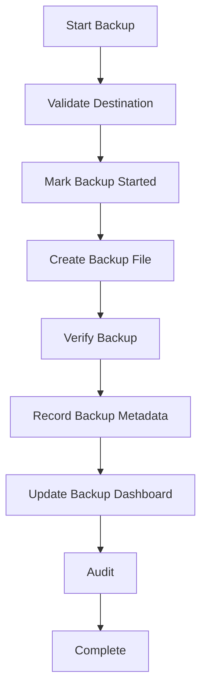

# Backup Workflow

## Purpose

Creates a restorable copy of local business data so the store can recover from device failure,
corruption, or accidental loss.

## Trigger

User starts a manual backup, or a scheduled local reminder prompts backup creation.

## Preconditions

- Store is initialized.
- User can create backups.
- Backup destination is available and writable.
- No restore is in progress.
- System can safely read required local data.

## Happy Path

1. User chooses backup destination.
2. System validates destination and available space.
3. Backup begins and records started status.
4. System creates backup from local data.
5. System verifies backup integrity where possible.
6. Backup metadata is recorded.
7. Dashboard backup status updates.
8. Audit log records backup result.

## Business Rules

- Backup must work offline.
- Backup must include all data required to restore the store.
- Backup should not interrupt completed business transactions.
- Failed backups must be visible.
- Backup success should mean the file was created and basic validation passed.
- Backup files should identify store, time, and application version.

## Failure Scenarios

- Destination unavailable: no backup file, show destination error.
- Insufficient space: fail before writing if detected, show required action.
- Power loss during backup: mark previous completed backups unchanged; partial backup must not be
  treated as valid.
- Verification failed: mark backup failed and warn user not to rely on it.
- Database lock: retry safely or fail without corrupting active data.

## Business Events Produced

- BackupStarted
- BackupCompleted
- BackupFailed
- DashboardMetricsUpdated
- AuditLogCreated

## Audit Requirements

Log user, destination type, backup start and end time, result, application version, store identity,
failure reason if any, and verification result.

## Reporting Impact

Updates backup health, last backup time, failed backup count, and support readiness indicators.

## Future Enhancements

- Encrypted backups
- Scheduled automatic backups
- Cloud backup
- External drive prompts
- Retention policy
