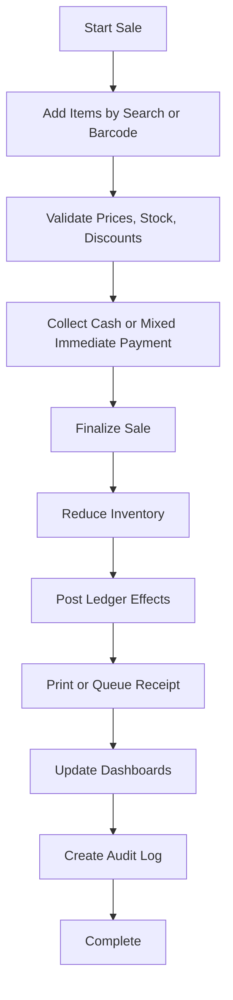

# Cash Sale Workflow

## Purpose

Records an immediate sale where payment is collected at completion and the customer does not carry a
receivable balance.

## Trigger

A cashier starts a sale for a walk-in or selected customer and chooses cash or mixed immediate
payment.

## Preconditions

- Store is initialized.
- Business day is open.
- User is logged in and allowed to create sales.
- At least one active cash account or cash drawer is available.
- Products are active and sellable.
- Stock-tracked products have available stock unless negative inventory is explicitly enabled.
- Receipt settings are configured if receipt printing is required.

## Happy Path

1. Cashier creates a draft sale.
2. Items are added manually or by barcode scan.
3. System validates product status, price, quantity, discount permission, and stock availability.
4. Cashier selects payment method and cash account.
5. System validates received amount and change due.
6. Sale is completed as an immutable business record.
7. Inventory transactions are posted for stock-tracked products.
8. Ledger-impacting records increase revenue and cash.
9. Receipt is printed or marked available for reprint if printer fails.
10. Dashboards and reports become eligible for updated sales, cash, margin, and inventory metrics.
11. Audit log records the completed sale.

## Business Rules

- Completed sales are immutable.
- A cash sale must be paid in full at completion.
- Paid amount cannot be less than sale total.
- Change due must not create a customer receivable.
- Archived products cannot be sold.
- Negative inventory is disabled by default.
- Discounts above the cashier limit require approval.
- Receipt printer failure must not reverse a successfully completed sale.
- Duplicate barcode matches must require product selection before the sale continues.

## Failure Scenarios

- Insufficient stock: block completion, no ledger or inventory effect, show the product and shortage.
- Payment cancelled: keep sale as draft or cancel it by user choice, no posting, show payment not
  recorded.
- Printer unavailable: keep sale completed, mark receipt as not printed, allow authorized reprint.
- Power loss before completion: recover or discard draft, no posted business effect.
- Power loss after completion: sale remains completed; recovery must not duplicate inventory or
  ledger effects.
- Duplicate barcode: pause item entry, require selection, do not add ambiguous item silently.
- Database lock: retry briefly; if still locked, keep draft unposted and ask user to retry.

## Business Events Produced

- SaleCreated
- SaleCompleted
- InventoryReduced
- CashReceived
- LedgerEntryPosted
- ReceiptPrinted
- DashboardMetricsUpdated
- AuditLogCreated
- LowStockDetected
- OutOfStockDetected

## Audit Requirements

Log sale number, user, business day, timestamp, items, quantities, discounts, payment method, cash
account, total, change due, printer result, and approval user where applicable.

## Reporting Impact

Updates today's sales, sales by cashier, cash in hand, gross profit estimate, product movement, low
stock, out of stock, and receipt reprint reports.

## Future Enhancements

- Card terminal integration
- Digital wallet payments common in Pakistan
- Customer loyalty points
- Fiscal printer integration
- Multi-branch receipt numbering
