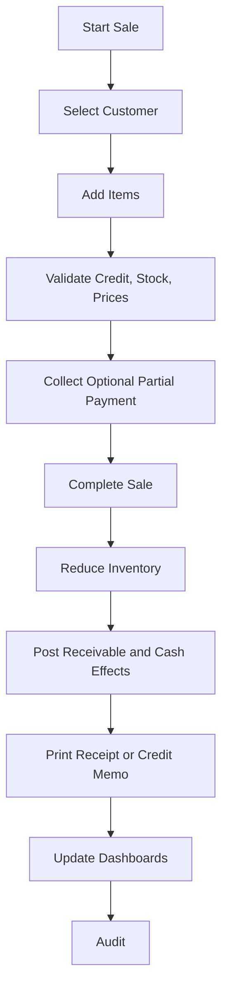

# Credit Sale Workflow

## Purpose

Records a sale where the customer pays later or pays partially, creating a receivable balance.

## Trigger

A user completes a sale for a selected credit-eligible customer with unpaid or partially paid
balance.

## Preconditions

- Store is initialized.
- Business day is open.
- User is logged in and allowed to create credit sales.
- Customer is active and not on hold.
- Customer credit sale is allowed by settings or approval.
- Products are active and sellable.
- Inventory is available unless negative inventory is enabled.

## Happy Path

1. User creates a draft sale.
2. User selects an active customer.
3. Items are added and validated.
4. System checks credit eligibility and any credit limit rule.
5. Optional partial payment is recorded with a cash account.
6. Sale is completed.
7. Inventory transactions reduce stock.
8. Ledger-impacting records increase revenue and receivables; partial payment also increases cash.
9. Receipt or customer credit slip is printed or queued.
10. Audit log records sale and credit impact.

## Business Rules

- Credit sales require a named active customer.
- On-hold customers cannot receive credit sales without approval.
- Partial payment is allowed only when a customer is selected.
- Customer balance is derived from ledger-impacting events.
- Completed credit sales cannot be edited.
- Customer overpayment is excluded from Version 1.0 unless approved.
- Cashier credit overrides require Manager, Admin, or Owner approval.

## Failure Scenarios

- Customer on hold: block completion, no posting, show hold reason where available.
- Credit limit exceeded: require approval or block, no posting until approved.
- Insufficient stock: block completion unless negative inventory override is approved.
- Partial payment fails: allow completion as full credit only if user confirms and has permission.
- Printer unavailable: complete sale, mark document unprinted, allow controlled reprint.
- Power loss after posting: recover completed sale without duplicate stock or receivable effects.
- Database lock: keep draft unposted and allow retry.

## Business Events Produced

- SaleCreated
- SaleCompleted
- InventoryReduced
- CustomerReceivableIncreased
- CashReceived
- LedgerEntryPosted
- ReceiptPrinted
- DashboardMetricsUpdated
- AuditLogCreated
- LowStockDetected
- OutOfStockDetected

## Audit Requirements

Log customer, user, items, totals, credit amount, partial payment, approval user, credit override
reason, business day, and receipt result.

## Reporting Impact

Updates sales, receivables, customer statements, cashier sales, inventory movement, gross profit,
low stock, and credit exposure dashboards.

## Future Enhancements

- Formal credit limits
- Customer statements by WhatsApp or SMS
- Payment due dates
- Installment sales
- Mobile collection app
