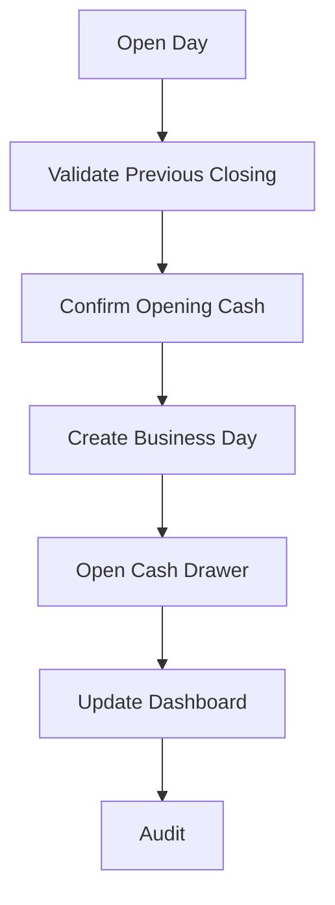

# Day Opening Workflow

## Purpose

Starts a business day so transactions can be grouped for retail operations, cash accountability, and
daily reporting.

## Trigger

Owner, Admin, Manager, or authorized cashier opens the store's business day.

## Preconditions

- Store is initialized.
- User can open day.
- No other business day is currently open.
- Required cash account or drawer is active.
- Previous day is closed or explicitly approved for carryover.

## Happy Path

1. User starts day opening.
2. System checks prior day status.
3. User confirms opening cash where required.
4. Business day is opened.
5. Cash drawer or cash account session is marked open where used.
6. Dashboard shows active business day.
7. Audit log records day opening.

## Business Rules

- Only one business day can be open for Version 1.0.
- Sales, purchases, payments, expenses, and adjustments require an open business day unless a setup
  workflow explicitly allows otherwise.
- Opening cash must be traceable.
- Opening a new day while a previous day is unclosed requires Owner/Admin approval.
- Business date should be visible in reports and audit logs.

## Failure Scenarios

- Previous day not closed: block or require approval to continue.
- Cash account missing: block cash workflows until configured.
- User lacks permission: block and show authorization message.
- Power loss before completion: day remains unopened.
- Power loss after completion: day remains opened; recovery must not create duplicate day.
- Database lock: do not open day; allow retry.

## Business Events Produced

- DayOpened
- CashDrawerOpened
- DashboardMetricsUpdated
- AuditLogCreated

## Audit Requirements

Log user, business date, opening cash amount where used, cash account or drawer, approval if
required, timestamp, and previous day status.

## Reporting Impact

Enables daily sales, cash, expense, stock adjustment, payment, and closing reports.

## Future Enhancements

- Multiple registers
- Cashier shifts
- Automatic opening reminders
- Branch-level day opening
