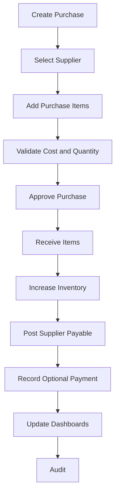

# Purchase Workflow

## Purpose

Records goods or services acquired from suppliers, increases stock when received, and creates or
settles supplier payable obligations.

## Trigger

A user records a supplier purchase or supplier invoice.

## Preconditions

- Store is initialized.
- Business day is open.
- User can create purchases.
- Supplier is active and not on hold.
- Products are active and purchasable.
- At least one purchase item is present before approval or receiving.

## Happy Path

1. User creates a draft purchase.
2. User selects supplier and purchase date.
3. Items, quantities, and costs are entered.
4. System validates supplier, products, quantities, costs, and totals.
5. Authorized user approves the purchase.
6. Items are received.
7. Inventory transactions increase stock for stock-tracked products.
8. Ledger-impacting records increase supplier payable.
9. Optional immediate supplier payment reduces cash and payable.
10. Reports and dashboards become eligible for updated purchase, payable, and stock metrics.
11. Audit log records approval and receiving.

## Business Rules

- Purchase requires an active supplier.
- Purchase requires at least one item before approval.
- Quantities must be greater than zero.
- Costs cannot be negative.
- Archived products cannot be purchased.
- Received purchases cannot be edited directly.
- Supplier balance is derived from ledger-impacting events.
- Immediate payment cannot exceed payable amount in Version 1.0.

## Failure Scenarios

- Supplier on hold: block approval unless authorized override exists.
- Archived product: block item addition or receiving.
- Invalid cost or quantity: keep draft, show line-level issue.
- Payment source closed: receive purchase on credit or choose active cash account.
- Power loss before receiving: purchase remains draft or approved with no stock effect.
- Power loss after receiving: purchase remains received; recovery must not duplicate stock or ledger.
- Database lock: do not post; keep document at previous state and allow retry.

## Business Events Produced

- PurchaseCreated
- PurchaseApproved
- PurchaseReceived
- InventoryIncreased
- SupplierPayableIncreased
- SupplierPaymentRecorded
- LedgerEntryPosted
- DashboardMetricsUpdated
- AuditLogCreated

## Audit Requirements

Log supplier, user, business day, item costs, quantities, approval user, receiving time, payment
source if paid, and any override reason.

## Reporting Impact

Updates purchase totals, stock received, supplier payables, inventory value, product cost history,
and supplier performance reports.

## Future Enhancements

- Purchase orders
- Partial receiving
- Supplier invoice attachments
- Landed cost
- Purchase approval thresholds
