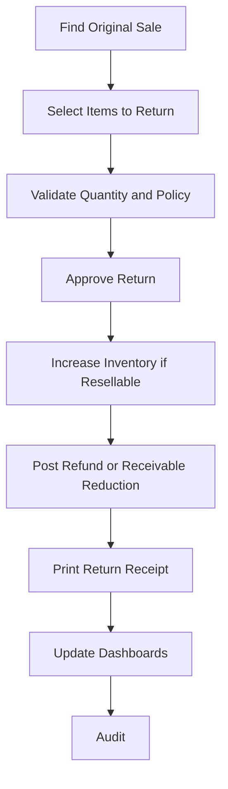

# Sales Return Workflow

## Purpose

Records goods returned by a customer and reverses the related sale, stock, cash, or receivable
effects according to policy.

## Trigger

A customer returns sold goods and an authorized user starts a return against an original sale where
possible.

## Preconditions

- Store is initialized.
- Business day is open.
- User can create returns.
- Original sale exists where required by policy.
- Returned item and quantity are identifiable.
- Return reason is provided.
- Refund method or credit treatment is selected.

## Happy Path

1. User finds original sale or creates an approved exception return.
2. User selects returned items and reason.
3. System validates return quantity, sale status, product status, and refund policy.
4. Authorized user approves return.
5. Inventory increases if returned goods are resellable; damaged returns may route to adjustment.
6. Ledger-impacting records reduce revenue, cash, or receivable as appropriate.
7. Return receipt is printed or queued.
8. Dashboard and reports update.
9. Audit log records return.

## Business Rules

- Returns must reference the original sale where possible.
- Return quantity cannot exceed sold quantity minus previous returns.
- Completed sales are not edited; returns are separate business facts.
- Cash refunds require sufficient cash account balance or approval.
- Credit sale returns reduce receivable balance.
- Damaged goods must not silently increase sellable stock.
- Return reason is required.

## Failure Scenarios

- Original sale not found: require approved non-referenced return or block.
- Return quantity exceeds sold quantity: block and show previous return quantity.
- Cash account insufficient: block cash refund or allow customer credit by policy.
- Printer unavailable: keep return posted, mark receipt unprinted.
- Power loss before posting: no stock or ledger effect.
- Power loss after posting: return remains posted; recovery must not duplicate stock or refund.
- Database lock: keep draft and retry.

## Business Events Produced

- SaleReturned
- InventoryIncreased
- CustomerReceivableReduced
- CashRefunded
- LedgerEntryPosted
- ReceiptPrinted
- DashboardMetricsUpdated
- AuditLogCreated

## Audit Requirements

Log original sale, customer if any, returned items, quantities, reason, refund method, user,
approver, business day, and receipt status.

## Reporting Impact

Updates sales returns, net sales, gross profit estimate, stock movement, customer balances, cash
movement, and return reason reports.

## Future Enhancements

- Exchanges
- Return windows
- Store credit vouchers
- Damaged goods workflow
- Return fraud indicators
