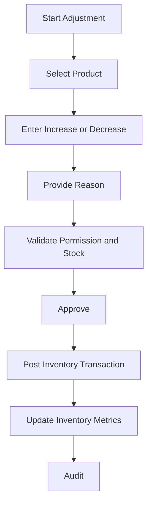

# Stock Adjustment Workflow

## Purpose

Corrects stock for known reasons outside sales and purchases, such as breakage, theft, spoilage,
manual correction, or discovered quantity mismatch.

## Trigger

An authorized user starts a stock adjustment for one or more products.

## Preconditions

- Store is initialized.
- Business day is open.
- User can create or approve stock adjustments.
- Product is stock-tracked.
- Adjustment reason is provided.
- Quantity is greater than zero.
- Negative stock rules are satisfied.

## Happy Path

1. User selects product and adjustment direction.
2. User enters quantity and reason.
3. System validates product, stock tracking, quantity, and negative stock rule.
4. Approval is captured when required.
5. Inventory transaction is posted.
6. Stock dashboard updates.
7. Audit log records adjustment.

## Business Rules

- Stock cannot be edited directly on the product.
- Every adjustment must create an inventory transaction.
- Adjustment reason is required.
- Posted adjustments are immutable.
- Stock decreases cannot create negative stock unless setting and approval allow it.
- High-value or high-quantity adjustments should require Owner/Admin approval.
- Financial inventory valuation effect must be documented when ledger integration is implemented.

## Failure Scenarios

- Product is not stock-tracked: block adjustment.
- Missing reason: block posting.
- Insufficient stock for decrease: block or require negative inventory override.
- Approval denied: keep draft or cancel, no stock effect.
- Power loss before posting: no stock effect.
- Power loss after posting: adjustment remains posted; recovery must not duplicate.
- Database lock: keep draft and retry.

## Business Events Produced

- InventoryAdjusted
- InventoryTransactionPosted
- LowStockDetected
- OutOfStockDetected
- DashboardMetricsUpdated
- AuditLogCreated

## Audit Requirements

Log product, old derived quantity, adjustment direction, quantity, reason, user, approver, business
day, timestamp, and resulting stock status.

## Reporting Impact

Updates stock movement, adjustment report, inventory value, low stock, out of stock, dead stock, and
audit reports.

## Future Enhancements

- Adjustment approval thresholds
- Photo attachment for damage
- Shrinkage analytics
- Mobile stock correction
- Multi-location adjustment
